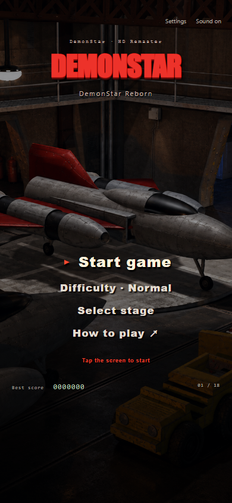

# DemonStar Reborn

**[简体中文](README.md) · [English](README.en.md)**

**[Download Android APK](https://github.com/Hashiao/DemonStar-Reborn/releases/latest/download/DemonStar-Reborn-release.apk)** · **[Download iPhone/iPad IPA — unsigned](https://github.com/Hashiao/DemonStar-Reborn/releases/latest/download/DemonStar.ipa)** · [All milestones](https://github.com/Hashiao/DemonStar-Reborn/releases)

An unofficial mobile HD remake of DemonStar 4.04, targeting **Android 10+ / iOS 12+**. Imagegen redraws reference the local original while preserving its red fighter and industrial science-fiction style. The independently implemented game code is open source.

The game supports Simplified Chinese, Traditional Chinese and English. First launch follows the phone's preferred language; settings allow an immediate, saved override. Traditional Chinese is independently worded with familiar game terminology for Hong Kong, Macao and Taiwan. Android and iOS share an offline Canvas engine hosted by WebView and UIKit/WKWebView. There are no ads, accounts, analytics or purchases. Solo/local two-player play works offline; optional native LAN uses local-network permissions without an internet relay.

**Current milestone M2.11 (v0.2.11) fixes iOS long-press selection and reorganizes solo, multiplayer and settings entries. This is not a complete 1:1 port.** The original eighteen stages take priority; stages 19–25 are undeveloped. See [fidelity status](docs/FIDELITY.en.md).




## Current milestone M2.11

- Fix iOS text selection/callouts while holding A/B or sticks. Guards cover both players and fixed/floating/eight-way controls; LAN text fields retain selection and paste.
- The first main entries are Single player → Multiplayer → Settings. Multiplayer offers same-device two-player or LAN play. Single player always starts P1; settings retain bindings without hiding LAN or player-count selection there.
- Empty space no longer starts a run; Enter activates the focused option. Settings/multiplayer have explicit trilingual accessible names. Classic HUD, red P1/blue P2, combat numbers, stage saves and native music retain their behavior.

168 engine/unit checks and six affected browser suites passed, plus Android build/Lint/API 37 controls, localization and native app-pair LAN. [iOS CI](https://github.com/Hashiao/DemonStar-Reborn/actions/runs/38060772488) passed iPhoneOS compilation, iOS 18.5 iPhone/iPad checks, native simulator-pair LAN and XCTest system 1.6-second long presses on solo/two-player A, B and sticks. Browsers separately verify six simultaneous contacts. Simulators do not replace the user's physical-device retest.

[APK](https://github.com/Hashiao/DemonStar-Reborn/releases/download/v0.2.11/DemonStar-Reborn-release.apk) · [Unsigned IPA — requires user signing](https://github.com/Hashiao/DemonStar-Reborn/releases/download/v0.2.11/DemonStar.ipa) · [SHA-256](https://github.com/Hashiao/DemonStar-Reborn/releases/download/v0.2.11/SHA256SUMS.txt) · [Full report](https://github.com/Hashiao/DemonStar-Reborn/releases/download/v0.2.11/verification.json)

[Main menu](docs/screenshots/m211-main-menu.png) · [Multiplayer](docs/screenshots/m211-multiplayer-menu.png) · [Diagnosis and changes](docs/M2_11_INPUT_MENU.md). Public play still caps at two; P3/P4 remain protocol reserves. Physical hotspots, native Android–iOS device pairs, peripherals and haptic feel remain untested.

## M2.10 completed

- Expose solo, same-device two-player and two-player LAN modes. P3/P4 remain protocol/core reserves; menus and rooms do not offer four-player play.
- Two touch players can move/fire/bomb together. Fixed sticks support layout/size changes, floating sticks use touch-down centers, and eight-way pads cap diagonal speed. Keyboard/mouse/controller assignment and simple remapping are available; duplicate controllers produce feedback and disable the conflicting seat.
- Preserve red P1, blue P2 and the classic icon HUD. The bottom-right blue ship sits left of the energy bar, with bombs above.
- Settings/pause can select all eighteen stages. Automatic and three manual slots retain both players' stage-entry lives/equipment/scores. The host controls launch/resume/stage/load; guests can pause and reconnect.
- Native haptics have saved preferences and capability checks. Cold-menu BGM attempts playback using a native iOS player while respecting mute, volume and background state.
- Original flags distinguish in-place explosions from reference-style sideways/upward deaths. Add nine damaged hulls and initial/final multi-point blasts; results use battlefield player/icon panels, and both platforms share a pixel launcher icon.

168 engine/unit checks and seventeen browser suites passed. Android project-signed Release, Debug, Lint and the existing API 37 emulator were verified. [iOS CI](https://github.com/Hashiao/DemonStar-Reborn/actions/runs/38056089782) passed the iPhoneOS build and iOS 18.5 iPhone/iPad checks, including twenty campaign/projectile/damaged-hull atlas decodes. Two native Android app processes and two iOS simulators independently exercised two-player native TCP. Physical hotspots, native Android–iOS device pairs, peripherals and haptic feel remain untested; simulator evidence does not certify them. Minimum deployment targets are not tested-version claims.

[APK](https://github.com/Hashiao/DemonStar-Reborn/releases/download/v0.2.10/DemonStar-Reborn-release.apk) · [Unsigned IPA](https://github.com/Hashiao/DemonStar-Reborn/releases/download/v0.2.10/DemonStar.ipa) · [SHA-256](https://github.com/Hashiao/DemonStar-Reborn/releases/download/v0.2.10/SHA256SUMS.txt) · [Full report](https://github.com/Hashiao/DemonStar-Reborn/releases/download/v0.2.10/verification.json)

[Two-player HUD](docs/screenshots/m210-classic-2p.png) · [Classic results](docs/screenshots/m210-results-2p.png) · [Implementation/limits](docs/M2_10_DEVELOPMENT.md) · [Outstanding device checks](docs/M2_10_DEVICE_CHECKLIST.md). Original HP, damage and campaign tables are unchanged. Fireball keyframes, debris and wall-clock timing remain approximate; complete 1:1 fidelity is not claimed.

## M2.9 completed

- Explicit mappings cover all 251 prototypes, including the 244 used by the eighteen stages. Add art for 213 missing prototypes and remove modulo enemy/generic terrain fallbacks. Stage-two lids, tanks, radar and turrets regain their own silhouettes.
- All 15 used enemy projectile types map to source frame names, colors and visible sizes, including the five-frame muzzle-bound red laser. Damage still comes from the original table.
- Five turret families have stationary bases and independently turning barrels. Load campaign atlases per stage, release obsolete tint caches, and require complete decoding before readiness.
- Review four representative times in each of eighteen video parts plus local original prototypes. Base-art coverage is not complete animation fidelity: some headings/rotation use a rotated single redraw; ground shadows and wrecks remain approximate.

109 regressions, ten browser suites and Android/iPhone/iPad checks passed for version 0.2.9 (11). See verification below and the [release report](https://github.com/Hashiao/DemonStar-Reborn/releases/download/v0.2.9/verification.json).

[Stage-two prototypes](docs/screenshots/campaign-02-prototypes.png) · [Enemy projectile gallery](docs/screenshots/enemy-projectiles-gallery.png) · [Evidence and limits](docs/M2_9_RESEARCH.md) · [Complete coverage](docs/campaign-art-coverage.json) · [Redraw provenance and full prompts](docs/ART_M2_9.md). HP, campaign data, player damage and provisional superweapon budgets remain unchanged.

## M2.8 completed

- Homing missiles restore the original thin 4×8 body and eight-unit speed per tick. Initial targets cycle, locks persist until invalid, and turning no longer causes cumulative speed loss.
- Restore source turn steps and post-turn alignment, sixteen headings, a 101-tick fuse and brief player-motion inheritance.
- Yellow side shots regain paired silhouettes; three blue lengths compose six tiers; red main bars widen per tier with separate decelerating auxiliary pellets. Remove the previous extra 1.5 enlargement of red/blue art.
- Keep the [user's eighteen-stage recording](docs/REFERENCE_VIDEO.md) as a long-term visual reference with explicit reviewed timestamps. All eighteen color/tier combinations are also audited against local original tables and sprites. HP, player damage, main cadence and superweapon budgets are unchanged.

104 regressions, nine browser suites and native Android/iPhone/iPad checks passed for version 0.2.8 (10). See verification below and the [release report](https://github.com/Hashiao/DemonStar-Reborn/releases/download/v0.2.8/verification.json).

[Yellow tiers](docs/screenshots/weapon-yellow-levels.png) · [Blue tiers](docs/screenshots/weapon-blue-levels.png) · [Red tiers](docs/screenshots/weapon-red-levels.png) · [Thin homing missiles](docs/screenshots/homing-missiles.png) · [Evidence and limits](docs/M2_8_RESEARCH.md) · [Built-in imagegen asset and full prompts](docs/ART_M2_8.md). Target-slot reuse, collision and trails remain approximate; magnetic steering is not verified in this pass.

## Completed M2.7

- Carrier launch including doors takes about 3.7 seconds with smooth interpolation. Combat speed and stage time are unchanged. Timing is a reference-based calibration, not an exact original-runtime measurement.
- The large stage-one tanker uses the original 44×87 visible silhouette ratio, retaining its 700 HP and collision geometry.
- Independent regular and boss health-bar settings: **regular bars OFF, boss bars ON by default**. Regular bars require maximum HP of at least 905, matching the opening square supply ship. Old combined settings migrate once.
- The blue bomb now wraps the player in violet lightning and projects a continuous thick blue laser, following movement and stopping at the nearest eligible forward target. Aura rings no longer travel as projectiles. The existing provisional damage budget remains.

94 regressions, eight browser suites and native Android/iPhone/iPad checks passed for version 0.2.7 (9). See verification below and the [release report](https://github.com/Hashiao/DemonStar-Reborn/releases/download/v0.2.7/verification.json).

[Default bar settings](docs/screenshots/m27-default-settings.png) · [Violet aura and blue laser](docs/screenshots/blue-laser-aura.png) · [Tanker proportions](docs/screenshots/tanker-proportions.png) · [Evidence and limits](docs/M2_7_RESEARCH.md) · [Built-in imagegen asset and full prompt](docs/ART_M2_7.md)

## Completed M2.6

- First launch reads the native preferred language: Simplified Chinese, Traditional Chinese including Taiwan/Hong Kong/Macao, or English fallback. Explicit Hans/Hant scripts take precedence.
- Switch immediately in main-menu or pause settings. Saved manual choices take precedence. Switching does not restart combat or reset equipment, scores, difficulty, unlocks or audio preferences.
- Menus, HUD, help, pickups, boss names, results and accessibility copy are localized. Launcher names follow the system. Original English radio and the DemonStar logo remain unchanged.
- Traditional copy uses natural terms such as 設定, 主選單, 搖桿, 飛彈, 電漿砲 and 強化火力 rather than automatic character conversion. Regional native-speaker review is not claimed.
- [Project instructions](AGENTS.md), [contribution rules](CONTRIBUTING.md), core comments, READMEs, significant commits and releases have Simplified Chinese and English versions. The [localization policy](docs/LOCALIZATION.md) defines ongoing verification.

87 regressions, seven browser suites and native Android/iPhone/iPad checks passed for version 0.2.6 (8). See verification below and the [release report](https://github.com/Hashiao/DemonStar-Reborn/releases/download/v0.2.6/verification.json).

[Simplified menu](docs/screenshots/menu-zh-Hans.png) · [Traditional menu](docs/screenshots/menu-zh-Hant.png) · [English menu](docs/screenshots/menu-en.png) · [Language settings](docs/screenshots/settings-en.png) · [iPhone English settings](docs/screenshots/ios-settings-en.png) · [iPad Traditional settings](docs/screenshots/ios-settings-zh-Hant.png)

## Completed M2.5

- Mechanical doors and carrier-deck launch on start and stage changes. Combat time, input and radio begin after the carrier leaves; launch supports pause/background resume.
- Bottom-left HUD removes atlas padding and has a readable minimum size. Default paired shots have a solid 3×13 crop; yellow enhancements and missiles also use tight crops.
- Animated ordinary-enemy explosions and larger impact fireballs for the relevant blue/red projectile types. Yellow shots retain small impacts. Boss final explosions precede the results panel.
- Eligible ground objects leave inert charred wrecks. Stage bonuses award remaining bombs ×1000 and medals ×2000 exactly once; death and stage changes clear medals.

Version 0.2.5 (7) passed 80 engine/audio regressions, six browser suites and Android/iPhone/iPad simulator checks. [Report](https://github.com/Hashiao/DemonStar-Reborn/releases/download/v0.2.5/verification.json). The carrier follows local4.04's grey 88 design; animation keyframes and shared wreck families remain approximations.

[Evidence and limits](docs/M2_5_RESEARCH.md) · [Carrier launch](docs/screenshots/carrier-launch.png) · [Impacts/explosions](docs/screenshots/hits-and-blasts.png) · [Ground wrecks](docs/screenshots/ground-remnants.png) · [Stage bonuses](docs/screenshots/stage-bonus.png) · [Imagegen prompts](docs/ART_M2_5.md)

## Completed M2.4

- Enemy projectile damage uses the original table: easy halves and floors it with a minimum of1; normal uses the base; hard adds1; insane adds2. Stage-one stars deal6/12/13/14 and laser contacts2/4/5/6.
- Collisions use a separate original branch: player damage4/12/16 by hull width, and enemy damage305. They do not reuse the projectile-difficulty formula.
- Ordinary hits no longer grant the old extra0.65s invulnerability. Respawn protection remains. Surviving hits leaving1–3 energy reduce yellow/blue/red power by one level, including6→5. Death still drops equipment and resets weapons.
- Correct six-frame S_ENEMY1A, 32-direction fixed net turrets and24-frame asteroid tumbling with corrected proportions.

Base enemy HP, player weapon tables and old superweapon budgets are unchanged. Version 0.2.4 (6) passed 69 regressions, five browser suites and both platforms' simulator checks. [Report](https://github.com/Hashiao/DemonStar-Reborn/releases/download/v0.2.4/verification.json) · [Evidence](docs/M2_4_RESEARCH.md) · [Fighter](docs/screenshots/fighter-corrected.png) · [Turrets](docs/screenshots/net-turrets.png) · [Asteroid frames](docs/screenshots/asteroid-24-poses.png) · [Downgrade](docs/screenshots/damage-tier-five.png) · [Art](docs/ART_M2_4.md)

## Completed M2.3

BGM defaults on for fresh installs and migrates old saves once, then respects deliberate mute choices. Meteors snapshot the player once at path exit. Stage-one bosses restore red-orange stars, paired missiles and three finite volleys of attached blue lasers; stars continue afterward. Pre-boss rotors use six animation poses and accelerate at their original path node.

HP, damage and superweapon budgets were frozen during that milestone. Version 0.2.3 (5) passed 56 regressions and Android/iPhone/iPad simulator checks. [Report](https://github.com/Hashiao/DemonStar-Reborn/releases/download/v0.2.3/verification.json) · [Evidence](docs/M2_3_RESEARCH.md) · [Stars](docs/screenshots/boss1-stars.png) · [Laser](docs/screenshots/boss1-laser.png) · [Rotor](docs/screenshots/spinner-poses.png) · [Art](docs/ART_ENEMY_ATTACKS.md)

## Completed M2.2 and earlier

Authorized BGM MP3s map to the original 18-stage music indices. The first three correspond to files05_相位,06_慢速火箭 and07. Twenty named entries deduplicate to18 tracks. Music/effects have separate volume/mute settings and resume from their paused position. See [music mapping](docs/MUSIC.md).

Pickups and boss arrival no longer display central blocking messages. An equipment panel shows weapon level, same-color advice and auxiliaries; M2.7 separates optional high-HP regular bars from boss bars. Offscreen enemies are protected. Tracking hulls keep turning, enemies flash near death, bosses burn/fall, and red/blue projectile tiers have distinct sizes.

Three superweapons display a forward golden mass,32 surrounding charges and a blue attack (corrected to aura plus continuous laser in M2.7). Boss radio uses W_RADIO1; launch, ambience and engine clips are separate, with original voice priorities. M2.4 later corrected incoming damage under new authorization; HP and old bomb budgets remain unchanged. [Limits](docs/M2_2_RESEARCH.md) · [Equipment/death rules](docs/DROPS_WEAPONS.md)

- Original 18 maps,8,368 placements and387 object definitions retain stable IDs, HP, speed, scores, paths, guns and drop metadata; no random substitute campaign.
- Separate boss definitions; four weapon families with six enhancement levels, missiles/homing, side/rear guns, shields, armor and lives. Some interactions still need original-runtime checks.
- Seven-digit score, spare ships,16 energy segments and individual bombs; four initial lives, three bombs and paired default guns.
- Bounded left-stick movement, hold/release A, B bombs, mixed inventory capped at six and used newest first. Multitouch and background/pause release are supported.
- Portrait phones and responsive landscape/fold/tablet layouts preserve battlefield aspect ratio and simulation.
- Original35ms fixed step with render interpolation, original enemy/world timing fields and doubled boss base HP. Wall-clock speed has not been fully calibrated against original recordings.
- AI-redrawn hangar, player,18 backgrounds,18 bosses, key stage-one objects and weapons. Uncovered objects still share approximate art. Co-op, networking and map editor are not included.

[Equipment](docs/screenshots/plasma-level6.png) · [Boss HUD/fire](docs/screenshots/boss-burning.png) · [Android portrait](docs/screenshots/android-game.png) · [Landscape](docs/screenshots/android-landscape.png) · [Plasma nova](docs/screenshots/nova-plasma.png) · [Supply art](docs/ART_SUPPLY.md) · [Player motion](docs/ART_MOTION.md)

## Installation

| Platform | Minimum deployment target | Package |
|---|---|---|
| Android | Android 10/API29 | Release APK signed with this project's own key |
| iPhone/iPad | iOS 12.0 | Actual iPhoneOS ARM64 **unsigned IPA** |

**Sign the IPA with your own Apple identity before installation. Downloading it does not make it directly installable. There is no TestFlight invitation.** Accounts, certificates, provisioning profiles and private keys are not included. Deployment targets do not mean the minimum versions were tested physically.

The public IPA filename is ASCII `DemonStar.ipa`; bundle paths and executable names are also ASCII, while launcher names support three languages. The precise historical installer error is unconfirmed; renaming does not certify every signing/installation tool.

Every completed milestone ships matching source, APK, IPA and `SHA256SUMS.txt` without replacing old tags. Release notes and READMEs identify tested environments and remaining limitations.

## Controls

Choose Single player or Multiplayer → same-device/LAN two-player play in the main menu. Settings → Players and controls configures touch style/layout, mouse ownership, controllers and action bindings. Movement is bounded; release, focus loss and device disconnect clear input.

| Input | Defaults |
|---|---|
| Touch | Independent movement stick/pad, A fire and B bomb for each player |
| Solo keyboard | WASD/arrows; Z/J fire; Space/X/K bomb; P/Esc pause |
| Two-player keyboard | P1: WASD, Z/X; P2: arrows, right Ctrl/right Shift; remappable |
| Mouse | Assign a player in settings; battlefield pointer guides bounded movement, left fire/right bomb |
| Controller | Left stick/d-pad moves; buttons 0/1 fire/bomb; remap for the device |

LAN requires installed apps on the same Wi-Fi/hotspot. The host creates a room and the guest enters its displayed address and six-digit code. Current rooms have two players, one per device; local two-player play is separate. Checkpoints restore the stage entry; selecting a stage starts with initial equipment. Save first to retain the previous entry. Settings switch all three languages immediately.

## Build

Requires Node.js 22+. Esbuild targets Safari 12/Chrome 74, with legacy WebKit touch, viewport and DOM fallbacks.

```sh
npm install
npm test
npm run build
npm start
```

Preview at `http://127.0.0.1:4173`. `dist/` is synchronized into both native projects. Only the shared web source is tracked, not duplicated native asset folders.

### Android

Reuse an existing SDK, JDK, AVD and Gradle cache. Maintainer defaults reference BenchBridge's existing tools; other contributors supply their own paths.

```powershell
python tools/prepare-signing.py --keytool "C:\path\to\jdk\bin\keytool.exe"
powershell -ExecutionPolicy Bypass -File tools/build-android.ps1 -SdkPath "C:\path\to\sdk" -JavaHome "C:\path\to\jdk" -Offline
```

The independent release key and password stay in ignored `.local/`. Back them up privately; never commit them. Offline builds require cached Gradle/Maven dependencies. The script does not install SDKs or system images.

### iOS

```sh
npm run build
python3 tools/generate-ios-project.py
open ios/DemonStar.xcodeproj
```

Choose your Team in Xcode for device installation. [iOS CI](https://github.com/Hashiao/DemonStar-Reborn/actions/workflows/ios.yml) builds an ARM64 unsigned device IPA on macOS, reuses installed iPhone/iPad simulators and records actual runtimes and WKWebView probes. A simulator app is never renamed to an IPA.

## Verification

M2.10 passed 168 engine/unit checks, seventeen browser suites, both Android builds/Lint (zero errors, 12 warnings), the existing API 37 emulator, and the linked iOS build/simulator checks. The report separates native app-pair/simulator evidence from untested physical hardware. The IPA is unsigned and requires user signing.

M2.9 passed 109 engine/audio/locale regressions and ten browser suites. All 244 used prototypes passed visible-pixel rendering checks, alongside 54 actual stage scenes, fifteen enemy-shot types and 32 headings for five fixed-base turret families. Current-stage new atlases decode to at most 78 MiB, not total app memory. Android Debug/project-signed Release builds, Lint (0 errors, 4 warnings), and the existing Android 17/API37 AVD passed language, controls, rotation, background and independent-bar checks. [iOS CI](https://github.com/Hashiao/DemonStar-Reborn/actions/runs/38028435099) passed the ARM64 iPhoneOS build and iOS 18.5 checks on iPhone 16 Pro and iPad Pro 11-inch (M4); all four native-language cases decoded and drew all eighteen new atlases. Both packages are version 0.2.9 (11); scripts, art, audio and locale resources match build inputs, allowing only HTML/CSS line-ending differences. The IPA is unsigned and requires user signing. Minimum OS versions and physical devices were not tested. [Full report](https://github.com/Hashiao/DemonStar-Reborn/releases/download/v0.2.9/verification.json).

Original HP/player-damage tables remain equal to v0.2.1. Minimum OS versions, phone-speaker audition and original-runtime sample-by-sample A/B checks remain unverified. W_PULSE was located in Game3.glb but is absent from authorized MP3 sources; 脉冲炮一 maps to W_PULSAR instead.

Legacy API fallbacks are simulated in Chromium, **not tested on a physical iOS 12 device**. `artifacts/*-verification.json` and releases record actual checks. Browser suites use Playwright and existing Chrome; set `PLAYWRIGHT_PATH` and optionally `GAME_URL`. The localization suite is `node tests/localization-browser.mjs`.

## Original data, assets and contributions

[Original combat research](docs/ORIGINAL_COMBAT_RESEARCH.md) documents the M1 discrepancies corrected in M2. Earlier releases remain unchanged. [Format](docs/FORMAT.md) · [Fidelity](docs/FIDELITY.en.md) · [Imagegen prompts/provenance](docs/ART.md) · [Notices](THIRD_PARTY_NOTICES.md) · [Weapon art](docs/ART_EFFECTS.md)

The original `Deamon Star/`, reference images, EXE, GLB, MAP and help files are excluded. Authorized MP3 copies have source/hash manifests. Rebuild campaign data from your own original installation:

```sh
python tools/import-campaign.py "/path/to/your/DemonStar"
```

Read [CONTRIBUTING.md](CONTRIBUTING.md) before contributing. New/changed core comments, significant Git information and releases must have Simplified Chinese and English versions; keep both READMEs synchronized.

Independent implementation code is [MIT](LICENSE). This does not relicense the original name, designs, stages or other third-party material; AI redrawing does not place original designs in the public domain. This project does not represent Mountain King Studios or Scott Host.
