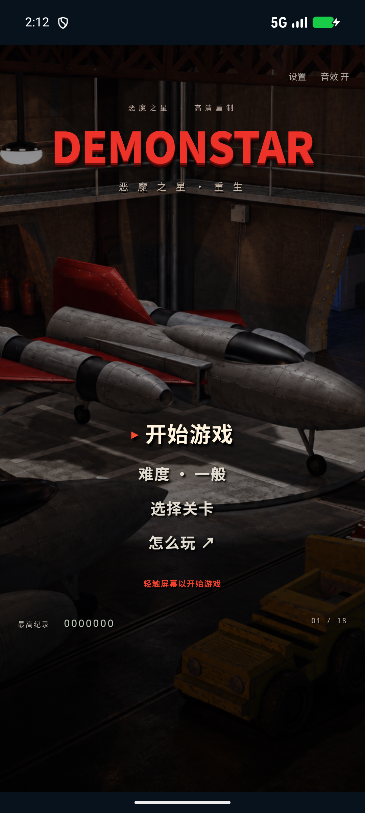

# DemonStar Reborn / 恶魔之星·重生

**[简体中文](README.md) · [English](README.en.md)**

**[下载 Android APK](https://github.com/Hashiao/DemonStar-Reborn/releases/latest/download/DemonStar-Reborn-release.apk)** · **[下载 iPhone / iPad IPA（未签名）](https://github.com/Hashiao/DemonStar-Reborn/releases/latest/download/DemonStar.ipa)** · [全部里程碑](https://github.com/Hashiao/DemonStar-Reborn/releases)

DemonStar 4.04 的非官方移动端高清复刻，目标 **Android 10+ / iOS 12+**。保留红色战机和经典工业科幻风格，参考本地原版素材用 imagegen 重绘，游戏实现代码开放。

游戏现提供简体中文、繁体中文和英语。首次启动按手机首选语言自动选择；设置可随时切换并保存。繁体中文采用港澳台常见游戏用语，独立润色。Android 与 iOS 共用离线 Canvas 游戏内核，分别由系统 WebView 和 UIKit/WKWebView 承载；没有广告、账号、埋点或内购。M2.9 发布包没有联网权限；M2.10 开发分支为可选局域网联机增加本地网络相关权限。

**当前已发布 M2.9（v0.2.9）补齐十八关缺失原型和敌弹映射，仍不是已验收的完整 1:1 移植。** 原版 1–18 关优先；19–25 关尚未开发。完整的确认项、推断值与差异见 [还原状态](docs/FIDELITY.md)。

开发分支 `codex/multiplayer-controls` 正在实现 M2.10：四人协议预留、当前单人/双人玩法、双人触屏、多种操作/改键、关卡存读档、原生局域网与震动，以及原作表现修复。红色 P1/蓝色 P2 与原作式图标 HUD 已按用户确认保留。完整双端验收与新安装包尚未发布，上方下载仍为正式版；进度和测试边界见 [开发记录](docs/M2_10_DEVELOPMENT.md) 与 [局域网记录](docs/M2_10_NETWORK.md)。



## 当前里程碑 M2.9

- 全战役 251 个原型建立显式映射，实际 18 关使用 244 个；补齐 213 个缺失原型，移除敌机编号取模和通用地物回退。第二关锅盖、坦克、雷达与炮台恢复各自外形。
- 15 种实际敌弹按原始帧名、颜色和可见尺寸映射，补上绑定炮口的五帧红色激光；伤害仍取原表。
- 五类炮台固定底座、独立转动炮管；图集按当前关加载并释放旧染色缓存，等待完整解码后才判定就绪。
- 对照十八个录像分集各四个代表时刻，并逐项检查本地原型。新增基础外形覆盖不等于完整动画逐帧还原；部分方向与旋转仍用单张重绘旋转近似，地面阴影及残骸仍有差异。

109 项回归、十组浏览器及 Android/iPhone/iPad 验收通过，版本 0.2.9（11）。详见下方测试记录与 [本版报告](https://github.com/Hashiao/DemonStar-Reborn/releases/download/v0.2.9/verification.json)。

[第二关原型](docs/screenshots/campaign-02-prototypes.png) · [敌弹图鉴](docs/screenshots/enemy-projectiles-gallery.png) · [证据与边界](docs/M2_9_RESEARCH.md) · [完整覆盖表](docs/campaign-art-coverage.json) · [重绘来源与完整提示词](docs/ART_M2_9.md)。HP、关卡、玩家伤害表和超级武器旧预算不变。

## M2.8 已完成内容

- 追踪弹恢复原作 4×8 细弹体，保持每步 8 的飞行速度；循环分配目标、保持锁定，失效后重选，转弯不再不断减速。
- 按原作恢复转向步长及转后对齐、16 向姿态、101 步保险丝和短暂的主机位移继承。
- 黄色高档侧弹恢复并排成对外形；蓝色三种长度组合六档；红色主条逐档加宽，辅助小弹恢复独立外形及减速。去掉旧版红蓝额外的 1.5 倍放大。
- [用户提供的十八关录像](docs/REFERENCE_VIDEO.md)作为长期视觉参考，记录本轮实际看过的代表时刻；全部十八档组合另核对本地原始表和图形。HP、主机伤害表、主炮射速与超级武器预算不变。

104 项回归、九组浏览器及 Android/iPhone/iPad 原生验收通过，版本 0.2.8（10）。详见下方测试记录及 [本版报告](https://github.com/Hashiao/DemonStar-Reborn/releases/download/v0.2.8/verification.json)。

[黄色六档](docs/screenshots/weapon-yellow-levels.png) · [蓝色六档](docs/screenshots/weapon-blue-levels.png) · [红色六档](docs/screenshots/weapon-red-levels.png) · [细追踪弹](docs/screenshots/homing-missiles.png) · [证据与边界](docs/M2_8_RESEARCH.md) · [内置 imagegen 素材与完整提示词](docs/ART_M2_8.md)。目标槽位回收次序、碰撞和烟迹仍有近似；磁力转向未在本轮核验。

## M2.7 已完成内容

- 母舰出击连同舱门约 3.7 秒，保留顺滑插值；战斗速度与关卡计时不受影响。时长属于参考校准，尚未完成原机逐帧测量。
- 首关大煤气罐按原作 44×87 可见轮廓修正宽高比例，保留 700 HP 与碰撞尺寸。
- 普通敌机与 Boss 血条独立设置，**默认普通血条关闭、Boss 血条开启**。普通条只显示最大 HP 达到开局方形补给机（905）及以上的敌人；旧合并设置一次性迁移。
- 蓝色炸弹改为包住主角的紫色闪电罩和连续粗蓝激光，随主角移动，在前方最近可攻击目标处停止；不再发射护罩圆环。伤害仍使用原有临时预算。

94 项回归、八组浏览器及 Android/iPhone/iPad 原生验收通过，版本 0.2.7（9）。详见下方测试记录及 [本版报告](https://github.com/Hashiao/DemonStar-Reborn/releases/download/v0.2.7/verification.json)。

[默认血条设置](docs/screenshots/m27-default-settings.png) · [紫色护罩与蓝激光](docs/screenshots/blue-laser-aura.png) · [气罐比例](docs/screenshots/tanker-proportions.png) · [原作证据与边界](docs/M2_7_RESEARCH.md) · [内置 imagegen 素材与完整提示词](docs/ART_M2_7.md)。

## M2.6 已完成内容

- 首次启动优先使用原生系统语言：简体中文、繁体中文（含台湾、香港、澳门）或英语回退；明确 Hans/Hant 字形优先。
- 主菜单及暂停设置可立即切换三语，手动选择优先并保存；不重开战斗、不重置装备、分数、难度、解锁或声音偏好。
- 菜单、HUD、帮助、补给提示、Boss 名称、结算及无障碍文案全部本地化；桌面显示名跟随系统。英文无线电录音和 DemonStar 标志保持原样。
- 繁体版独立改写，采用「設定、主選單、搖桿、飛彈、電漿砲、強化火力」等通用表达，不机械转字。
- [项目规范](AGENTS.md)、[贡献约定](CONTRIBUTING.md)、核心注释、README、重要提交和 Release 提供简体中文及英文；[语言规范](docs/LOCALIZATION.md)规定后续验收要求。

87 项回归、七组浏览器及 Android/iPhone/iPad 原生验收通过，版本 0.2.6（8）。详见下方测试记录及 [本版报告](https://github.com/Hashiao/DemonStar-Reborn/releases/download/v0.2.6/verification.json)。

[简体菜单](docs/screenshots/menu-zh-Hans.png) · [繁体菜单](docs/screenshots/menu-zh-Hant.png) · [英文菜单](docs/screenshots/menu-en.png) · [语言设置](docs/screenshots/settings-en.png)。繁体文案未声称经过地区母语玩家审校。[iPhone 英文设置](docs/screenshots/ios-settings-en.png) · [iPad 繁体设置](docs/screenshots/ios-settings-zh-Hant.png)。

## M2.5 已完成内容

- 开始和换关增加机械舱门与母舰甲板出击，母舰离场后才开始关卡计时、操作和无线电；出击期间可暂停/后台恢复。
- 左下 HUD 去掉透明留白并设置最低显示尺寸；默认双发弹体恢复清晰的 3×13，黄色增强/导弹也使用紧裁切。
- 普通敌机击毁新增逐帧爆炸；蓝红强化弹按原弹型使用大命中火花，黄色维持小火花。Boss 最终爆炸后才进入结算。
- 指定地面目标保留焦黑残骸；奖励按剩余炸弹 ×1000、勋章 ×2000 计算且只入账一次。死亡/换关清零勋章。

80 项回归、六组浏览器及 Android/iPhone/iPad 模拟器验收通过，版本 0.2.5（7）。详细环境和边界见下方测试记录及 [本版报告](https://github.com/Hashiao/DemonStar-Reborn/releases/download/v0.2.5/verification.json)。

[原作证据与边界](docs/M2_5_RESEARCH.md) · [母舰出击](docs/screenshots/carrier-launch.png) · [命中与击毁](docs/screenshots/hits-and-blasts.png) · [地面残骸](docs/screenshots/ground-remnants.png) · [关末奖励](docs/screenshots/stage-bonus.png) · [内置 imagegen 图集与提示词](docs/ART_M2_5.md)。母舰以本地 4.04 灰色 88 原型为准；特效关键帧和残骸家族仍为重绘近似。

## M2.4 已完成内容

- 敌弹从原始弹型表取伤害，按容易/一般/较难/疯狂分别减半取整（最低 1）、原值、加 1、加 2；例如首关星弹为 6/12/13/14，激光每次命中为 2/4/5/6。
- 普通撞机使用原作独立分支，按机体宽度扣 4/12/16，并使敌机损失 305 HP。该分支不套用敌弹的难度公式。
- 普通中弹不再获得旧版额外 0.65 秒无敌；保留重生保护。黄/蓝/红武器受伤后剩 1–3 能量时降一级，包含满级 6→5；死亡仍按原有规则掉球并重置。
- 圈中 S_ENEMY1A 改为正确六帧原型，后段网架改为 32 向固定炮台，大岩石修正宽度并恢复 24 帧翻滚。

敌机基础 HP、主机伤害表及超级武器旧预算保持原值。[原作伤害与动画证据](docs/M2_4_RESEARCH.md) · [正确敌机](docs/screenshots/fighter-corrected.png) · [网架炮台](docs/screenshots/net-turrets.png) · [岩石翻滚帧](docs/screenshots/asteroid-24-poses.png) · [受伤降档](docs/screenshots/damage-tier-five.png) · [imagegen 图集与完整提示词](docs/ART_M2_4.md)。

69 项回归、五组浏览器与 Android/iPhone/iPad 模拟器验收通过，版本 0.2.4（6）。环境及边界见下方测试记录和 [本版报告](https://github.com/Hashiao/DemonStar-Reborn/releases/download/v0.2.4/verification.json)。

## M2.3 已完成内容

- 新安装及旧存档升级后默认开启 BGM；升级后手动静音仍会保存，不会每次启动强行打开。
- 冲向主机的流星在路径结束时仅瞄准一次，之后直线飞行，不会持续追踪玩家位置。
- 第一关 Boss 恢复红橙色四芒星弹、双侧导弹、中央蓝色贯穿激光。激光按原炮位表发射三轮，每轮五次，随后停止；星弹继续。
- Boss 前的陀螺恢复六帧横向旋转，并在原路径节点短暂加速俯冲。路径速度按原逻辑逐步变化，不改原数据表。

HP、敌弹/撞击伤害和超级武器预算保持冻结。[原作证据与边界](docs/M2_3_RESEARCH.md) · [星弹画面](docs/screenshots/boss1-stars.png) · [蓝色激光](docs/screenshots/boss1-laser.png) · [旋转敌机六帧](docs/screenshots/spinner-poses.png) · [内置 imagegen 重绘与提示词](docs/ART_ENEMY_ATTACKS.md)。

56 项回归及 Android、iPhone/iPad 模拟器验收通过，安装包版本 0.2.3（5）。详细环境与边界见下方测试记录和 [本版验收报告](https://github.com/Hashiao/DemonStar-Reborn/releases/download/v0.2.3/verification.json)。

## M2.2 已完成内容

本轮使用用户提供的 BGM，直接核对原程序的 18 关音乐跳转表；前三关对应“05_相位、06_慢速火箭、07”。20 个命名音频去重为 18 首，音乐与音效独立开关/音量，后台暂停、恢复续播。完整表见 [音乐核对](docs/MUSIC.md)。

全部拾取/清屏与 Boss 出场不再弹出中央字幕；底部显示武器图标、六格等级、同色升档提醒和辅助装备。M2.7 已将血条拆为普通高血量敌机和 Boss 两项独立设置。统一保护屏外敌人，恢复持续朝向玩家的机型、濒死红闪、Boss 燃烧坠毁过程，以及蓝色三档、红色六档的弹体尺寸。

三种超级武器分别表现为前射金色能量团、32 枚周围投弹和蓝色攻击（M2.7 已改正为护罩与连续激光）；Boss 出场改为 W_RADIO1，补齐出击声和战场环境音，限制同类音效叠加并移除 A/B 的菜单点击声。M2.2 当时按用户要求冻结 HP 与伤害；M2.4 经新授权修复受伤规则，敌机 HP 和炸弹旧预算继续保留。[旧预算与还原边界](docs/M2_2_RESEARCH.md)。

M2.1 的固定掉落、换色归零、死亡掉球、满级三色清屏继续保留，详见 [装备与死亡规则](docs/DROPS_WEAPONS.md)。

- 导入原版 **18 关、8,368 条放置记录、387 条对象定义**，按稳定 ID 绑定对象；保留血量、速度、分数、路径、炮位和地图原始附加字段。
- 敌方炮位解释器支持原数据中的延迟、连射、瞄准、角度、弹速、次数；18 位 Boss 使用各自的原始定义和高清外形。
- 主机四类武器、六级火力、导弹、追踪导弹、侧/后向射击、超级武器、装甲修复、护盾与生命系统；部分数值和特殊效果仍需原作运行对照。
- 恢复七位得分、备用战机图标、16 格蓝色能量条和逐枚炸弹库存；开局 4 条命、3 枚炸弹，默认机炮左右双发。
- 左摇杆控制有上限的移动速度，按住 A 开火，B 释放炸弹；最多 6 枚、混合类型、后拾取先使用。支持多指、暂停/切后台释放输入。
- 手机竖屏不强制左右边框；折叠屏、平板和手机横屏重排控制区域，战场保持等比。
- 修正全部 16 类补给编号及已核实的轮换关系，使用新生成的高清图标；能量晶体恢复 2 格。
- 逻辑采用原作代码中的 35 毫秒基础节拍，绘制插值保持平滑；敌方移动/射击与关卡滚动统一计时，Boss 出场按原版采用两倍基础 HP（纠正 v0.2.0 的误改）。尚未完成原作录像逐帧速度验收。
- 原作机库菜单、主机、十八关背景、全部 Boss、第一关主要敌机/地物与武器弹体已有 AI 高清素材；尚未覆盖的敌机和地物仍有近似图形。原版 BGM 已按用户提供 MP3 接入；双人、联网、地图编辑器未包含。

[装备栏与红色六档](docs/screenshots/plasma-level6.png) · [顶栏 Boss 血条与燃烧](docs/screenshots/boss-burning.png) · [Android 竖屏实测画面](docs/screenshots/android-game.png) · [横屏实测画面](docs/screenshots/android-landscape.png) · [满级等离子清屏](docs/screenshots/nova-plasma.png) · [补给舱高清图集](docs/ART_SUPPLY.md) · [主机姿态图集](docs/ART_MOTION.md)

## 安装

| 平台 | 最低部署目标 | 交付形式 |
|---|---|---|
| Android | Android 10 / API 29 | 本项目独立签名的 Release APK |
| iPhone / iPad | iOS 12.0 | 真正 iPhoneOS ARM64 构建的 **未签名 IPA** |

**IPA 需要用自己的 Apple 身份签名后才能安装，下载不等于可直接安装。当前没有 TestFlight 邀请。** 仓库不包含账号、证书、配置描述文件或签名私钥。最低部署目标不代表已在最低版本实机验收。

M2 的 IPA 文件名统一为纯字母 `DemonStar.ipa`；包内目录及可执行文件也是英文，桌面显示名支持三语。此前安装器报错的确切原因尚未确认，文件命名调整不代表所有签名/安装工具均已验收。

每个完成的里程碑都提交对应源码并发布 APK、IPA 与 `SHA256SUMS.txt`；不覆盖已有版本标签。GitHub Release 与 README 会明确列出实际测试的系统版本和仍未完成的事项。

## 操作

| 动作 | 手机 / 平板 | 电脑 |
|---|---|---|
| 移动 | 左侧虚拟摇杆 | WASD / 方向键 |
| 开火 | 按住右侧 A，松开停止 | 按住 Z / J |
| 超级武器 | 右侧 B | 空格 / X / K |
| 暂停 | Ⅱ / 系统返回 | Esc / P |

接触补给拾取，持续躲避弹幕并留意装甲。当前各难度分别保存最高分与解锁进度。

## 构建

开发需要 Node.js 22+。构建包使用 esbuild 转译至 Safari 12 / Chrome 74，并提供旧 WebKit 触摸、视口布局和 DOM API 回退。

```sh
npm install
npm test
npm run build
npm start
```

浏览器预览打开 `http://127.0.0.1:4173`。构建产物在 `dist/`，并同步至两个原生工程。仓库只保存一份网页源代码，不重复提交原生资源副本。

### Android

复用已有 SDK、JDK、Gradle 缓存，不重复安装 SDK 或 AVD。维护者环境默认复用 BenchBridge 的工具配置；其他开发者传入自己的路径。

```powershell
python tools/prepare-signing.py --keytool "C:\path\to\jdk\bin\keytool.exe"
powershell -ExecutionPolicy Bypass -File tools/build-android.ps1 -SdkPath "C:\path\to\sdk" -JavaHome "C:\path\to\jdk" -Offline
```

独立 Release 密钥与密码只保存在忽略的 `.local/`。请私下备份；不要提交它们。首次离线构建要求所需 Gradle/Maven 依赖已在缓存中。脚本不安装 SDK 或系统镜像。

### iOS

```sh
npm run build
python3 tools/generate-ios-project.py
open ios/DemonStar.xcodeproj
```

在 Xcode 选择自己的 Team 后真机安装。无 Mac 可使用 [iOS CI](https://github.com/Hashiao/DemonStar-Reborn/actions/workflows/ios.yml)：在 macOS 编译 ARM64 未签名 IPA，复用已安装的 iPhone/iPad 模拟器，记录实际系统和 WKWebView 探针结果。不会把模拟器包改名冒充 IPA。

## 测试

M2.9 的 109 项引擎/声音/语言回归与十组浏览器检查通过。全部 244 个实际使用原型通过实绘可见像素检查，十八关 54 个场景、15 种敌弹和五类炮台的 32 朝向通过；当前关新增图集解码量最高 78 MiB，不代表 App 总内存。Android Debug/项目签名 Release、Lint（0 错误、4 提示）及现有 Android 17/API37 AVD 的三语、操作、旋转、后台恢复和独立血条设置通过。[iOS CI](https://github.com/Hashiao/DemonStar-Reborn/actions/runs/38028435099) 通过 iPhoneOS ARM64 构建及 iOS 18.5 的 iPhone 16 Pro、iPad Pro 11-inch (M4) 检查；四种原生语言场景均逐张解码并绘制全部 18 张新增图集。两包版本 0.2.9（11），脚本、图集、音频、本地化资源与构建输入一致，仅允许 HTML/CSS 平台换行差异。IPA 未签名，须自行签名；最低系统及真机未实测。[完整验收](https://github.com/Hashiao/DemonStar-Reborn/releases/download/v0.2.9/verification.json)。

原始 HP/主武器伤害表与 v0.2.1 一致。最低系统、手机扬声器和原机逐样本 A/B 仍未实测；独立激光启动音 W_PULSE 已定位在 Game3.glb，尚未包含在用户提供的 MP3 清单，“脉冲炮一”是另一资源 W_PULSAR。

旧 API 回退测试在 Chromium 中模拟缺失接口，**不是 iOS 12 真机测试**。`artifacts/*-verification.json` 和 Release 说明记录实际测试情况。

可选浏览器回归需要 Playwright 与已有 Chrome：`node tests/browser.mjs`。使用已有包时可设置 `PLAYWRIGHT_PATH`；`GAME_URL` 可指向构建后的预览服务。

## 原作数据与素材

最新 [原版战斗与布局取证](docs/ORIGINAL_COMBAT_RESEARCH.md) 已确认开局双发、16 点能量、经典 HUD 和掉落编号差异，并记录手机竖屏、折叠屏/平板横屏及左摇杆右 A/B 的后续目标。M1 安装包保持原样；本次修正属于 M2。

[格式记录](docs/FORMAT.md) · [还原差异](docs/FIDELITY.md) · [imagegen 提示词与素材来源](docs/ART.md) · [第三方声明](THIRD_PARTY_NOTICES.md) · [M2.2 武器图集与提示词](docs/ART_EFFECTS.md)

原始 `Deamon Star/`、参考图、EXE、GLB、MAP 与帮助文件不进入仓库。用户提供的音效和 BGM MP3 副本按声音/音乐清单记录来源与哈希。导入器可从用户自己的原版安装中重建关卡数据：

```sh
python tools/import-campaign.py "/path/to/your/DemonStar"
```

贡献前请阅读 [双语贡献约定](CONTRIBUTING.md)。新增/修改的核心注释、重要 Git 信息及发布说明提供简体中文和英文，两个 README 同步维护。

独立实现代码采用 [MIT](LICENSE)。该许可不重新授权原作的名称、设计、关卡或其他第三方内容；AI 重绘也不表示原设计进入公有领域。本项目不代表 Mountain King Studios / Scott Host。
