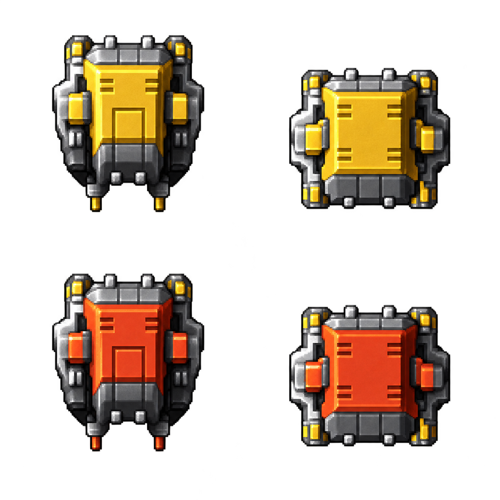

# 原版掉落、换色、档位与死亡规则

依据本地 DemonStar 4.04 的地图和程序。数值表可由 `tools/audit-drops.py`、`tools/import-player-rules.py` 重建；普通构建不需要原作或反汇编工具。原始程序、图片、录音均不进入仓库。

## 全战役装备来源

18 关共有 **411 条显式掉落记录**，另有 **191 个自动补给放置点、13 个自动补给定义**。完整逐条清单（关卡、坐标、稳定 ID、外形、标志、掉落）见 [drop-catalog.json](drop-catalog.json)。

| 装备编号 | 含义 | 显式记录数 |
|---|---|---:|
| 0 | 勋章 | 212 |
| 1 | 能量 | 16 |
| 2 / 3 | 质子 / 离子起始颜色 | 2 / 3 |
| 5 / 6 | 金色 / 红色炸弹 | 34 / 23 |
| 7 | 护盾 | 10 |
| 8 / 9 | 普通 / 追踪导弹 | 16 / 14 |
| 10 | 三色满火力 S | 45 |
| 11 | 能量晶体 | 24 |
| 12 / 13 | 侧射 / 后射 | 7 / 5 |

固定装备主要装在金色长补给舱 `S_ENBON1`、金色方补给箱 `S_ENBON2`；橙红色对应型 `S_ENBON3/4` 还带自动补给标志，可能同时产生显式装备和自动补给。雷达、坦克、地面设施及部分普通敌机也有指定物品。**同一外形不能决定一个永久固定的装备种类，必须读取该放置点记录。**

清单不是“所有东西都能直接打爆”的列表。原版 `0x4114eb` 排除标志 `0x10` 的主炮目标，部分管道、油管等记录虽带掉落字段也受这个条件限制；当前不为得到装备擅自把背景改成可破坏物。连锁/脚本破坏仍需单独核对。

自动补给由 `0x411195` 的 `0x200` 标志进入 `0x423c70`。基础序列 `[2,3,4,13,14]`，前六关只循环前三项。其他条件与补给追补见 [AUDIO_MOTION.md](AUDIO_MOTION.md)。

## 拾取前的变化与拾取后的升级是两件事

- 黄 S → 蓝 S → 红 S → 黄 S，对应 `[2,3,4]` 的循环；按碰到时实际颜色拾取。
- 普通 M / 追踪 M 相互轮换；侧射 / 后射相互轮换；金色 / 红色 B 相互轮换。
- 满火力 S（编号 10）不轮换，不是普通颜色球。磁力与超级脉冲的首轮转入规则另见原表。
- 原版首次轮换计数通常 180，随后 110；减到负值切换。当前按 35 ms 基础逻辑步长运行，不把计数当作精确原机墙钟时间。

## 武器槽、颜色、档位与归零

`0x427050` 初始化武器槽，`0x4244f5` 遍历启用槽，`0x423a30` 处理切换升级。基本机炮与增强槽是叠加关系。

| 动作 | 原版规则与本版实现 |
|---|---|
| 未拾取增强 | 基础双发；增强档位为 0 |
| 首次拾取颜色球 | 启用该色最低增强档；保留基础双发 |
| 同色再次拾取 | 升一档，最高六档（原程序内部编号 0–5） |
| 拾取不同色 | 新颜色从最低档开始，旧颜色档位清空；切回来不恢复旧档 |
| 满火力 S | 当前颜色直接升至最高档；若尚无增强，启用满级质子；保留基础双发 |
| 已满级再吃同色球 / 满火力 S | 保持颜色与最高档，触发对应清屏弹 |
| 换成另一色，即使旧色满级 | 切到新色最低档，不触发旧色清屏 |
| 死亡 | 增强归零，仅保留基础双发；导弹、侧后射清零，炸弹重置为初始三枚 |
| 经典三色且剩余能量 1–3 时受伤 | 现有增强仍有可降档时降低一档（`0x4265aa` 起） |

炮位、弹型、原始伤害及等离子 16 相位扇扫表保存在 `web/js/player-rules.js`，不是依等级临时拼凑子弹数。满级一轮同时触发时：质子 2 基础 + 6 增强，离子 2 + 4，等离子 2 + 2，磁力 2 + 1。基础/质子每 4 个逻辑步一轮，其他增强每 2 步一轮，因此连续弹幕不能只看同一帧数量。

## 导弹、侧后射、炸弹

- 导弹共用一份弹药与一种当前类型。首次拾取或换类型为 50 组；同类型继续拾取加 50 组。每组从左右两个炮口发出，消耗一组；普通与追踪不是两个各 20 发的独立库存。间隔为 17 个逻辑步，原始弹速分别 9 / 8、伤害 100 / 200。
- 侧射/后射不会 25 秒后自动消失。首次获得为 2 连发，重复拾取升到 3、4 连发上限，使用独立的连发/间隔计数；死亡清除。
- 炸弹容量 6，按各自类型储存、后拾取先用；两次使用之间有 35 步间隔。超级武器的全部爆炸传播、特殊部件交互仍有近似，不能把库存规则确认等同于全部特效 1:1。

## 死亡掉落

`0x423ba0` 在清空装备前读取现有状态。经典黄、蓝、红增强，低于最高档时掉 **1 个同色球**，最高档时掉 **2 个同色球**；只有基础机炮时不掉颜色球。4.04 的磁力槽在此分支沿用红色球编号，保留该版本行为。

此外，导弹剩余超过 39 组时掉普通 M，炸弹超过 3 枚时单人红机掉一枚红 B。生成顺序是导弹、额外炸弹、额外颜色球、基础颜色球；掉落按原版位置分支抛出，再开始轮换。

`0x42650f` 起设 45 步重生等待和 135 步总保护计数。等待期间主机不移动、不开火、不拾取，防止死亡掉球在同一帧立即被捡回；重生后可重新拾取，从最低增强档恢复。

## 三色满级清屏弹

由 `0x423a79` 满级溢出分支进入 `0x429980`，不是消耗炸弹，也不是任意切色就触发。

| 当前增强 | 弹型 | 环形数量 | 原始速度（每步） | 单弹伤害 |
|---|---:|---:|---|---:|
| 质子 / 黄 | 45 | 16 | 6 | 355 |
| 离子 / 蓝 | 46 | 32 | 4、5、6、5 循环 | 400 |
| 等离子 / 红 | 47 | 64 | 4、5、6、7 循环 | 405 |

4.04 另有磁力溢出弹型 60，64 发，使用原表伤害 250。画面分别使用原作对应颜色/形态的高清弹体。碰撞范围、贯穿和磁力转向等仍属于待原机运行对照的部分；不会表述为已经完成像素级或整场录像验收。

## 本轮额外纠错

复核发现 v0.2.0 取消 Boss 双倍血量是错误的：原版 `0x40f402`～`0x40f43f` 确实在出场时将基础 HP 加一次。本版恢复单人 `2×基础 HP`，与最初格式记录一致。双人额外值不在当前单人版本范围。
